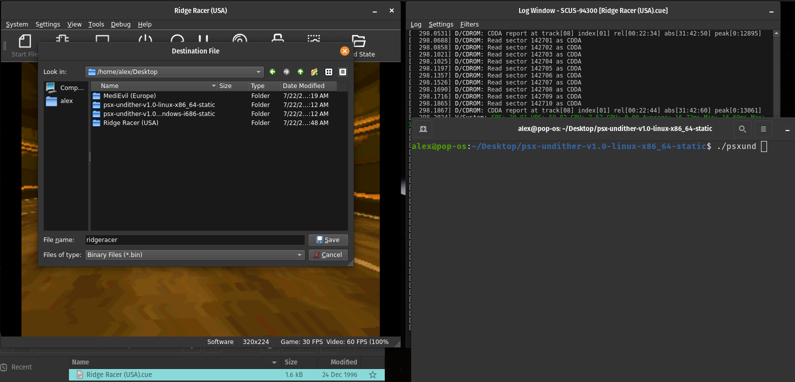

# PSX Undither

_By Alex Free_.

Patch PlayStation 1 games to turn off the [dithering effect](#what-is-dithering) by either modifying the CD image directly, or generating GameShark codes from a DuckStation RAM dump.

| [Homepage](https://alex-free.github.io/psx-undither) | [Github](https://github.com/alex-free/psx-undither) |

## Table Of Contents

*   [Downloads](#downloads)
*   [What Is Dithering?](#what-is-dithering)
*   [How Does This Work?](#how-does-this-work)
*   [Downloads](#downloads)
*   [Usage](#usage)
*   [Getting A DuckStation RAM Dump](#getting-a-duckstation-ram-dump)
*   [License](#license)
*   [Credits](#credits)
*   [Building](build.md)

## Downloads

### Version 1.0 (7/23/2024)

Changes:

*    Initial release.

----------------------------------------------------

*	[psx-undither-v1.0-windows-i686-static.zip](https://github.com/alex-free/psx-undither/releases/download/v1.0/psx-undither-v1.0-windows-i686-static.zip) _Portable Release For Windows 95 OSR 2.5 and above, Pentium CPU minimum (32 bit)_

*	[psx-undither-v1.0-windows-x86\_64-static.zip](https://github.com/alex-free/psx-undither/releases/download/v1.0/psx-undither-v1.0-windows-x86_64-static.zip) _Portable Release For x86_64 Windows (64 bit)_

*	[psx-undither-v1.0-linux-i386-static.zip](https://github.com/alex-free/psx-undither/releases/download/v1.0/psx-undither-v1.0-linux-i386-static.zip) _Portable Release For Linux 3.2.0 and above, 386 CPU minimum (32 bit)_

*	[psx-undither-v1.0-linux-i386-static.deb](https://github.com/alex-free/psx-undither/releases/download/v1.0/psx-undither-v1.0-linux-i386-static.deb) _Deb package file For Linux 3.2.0 and above, 386 CPU minimum (32 bit)_

*	[psx-undither-v1.0-linux-x86\_64-static.zip](https://github.com/alex-free/psx-undither/releases/download/v1.0/psx-undither-v1.0-linux-x86_64-static.zip) _Portable Release For x86\_64 Linux 3.2.0 and above (64 bit)_

*	[psx-undither-v1.0-linux-x86\_64-static.deb](https://github.com/alex-free/psx-undither/releases/download/v1.0/psx-undither-v1.0-linux-x86_64-static.deb) _Deb package file for x86_64 Linux 3.2.0 and above (64 bit)_

---------------------------------------

## What Is Dithering?

Dithering is a graphical effect that exploit the blur of a CRT set in combination with a composite signal in order to create transparency or texture related detail/color illusion effects. Most PS1 games were explicitly designed with the expected setup of a CRT TV using a composite signal (be that S-Video or standard AV RCA cables) in mind.

PS1 Console models (Before SCPH-5000) with the original [dual-ported VRAM GPU](https://problemkaputt.de/psx-spx.htm#gpuversions) have a less advanced dithering capability then ones with the newer SGRAM GPU. This may make disabling of dithering even more obvious on the old console models with the original GPU design.

Without a CRT TV dithering can make some games appear less sharp and nosier (an opinion shared by many, but not a fact), causing a non-intentional checkerboard pattern on textures and or a noticeable drop in clarity on TV's using Plasma, LCD, OLED, or similar non-CRT-based screen technologies. In fact, most emulators do not emulate dithering by default with their default (hardware-based) renderers (i.e. [DuckStation](https://www.duckstation.org/) requires you to use the software renderer in order to see any dithering):

## Dither ON (DuckStation Software Renderer):

## Dither OFF (DuckStation Software Renderer):

Note: the floor, the background, the character models.

For more info on PS1 dithering, please see [ConsoleMods Wiki: PS1 De-dithering Patch](https://consolemods.org/wiki/PS1:De-dithering_Patch) and [PlayStation 1 Dithering Removal - by Chris Covell](https://www.chrismcovell.com/psxdither.html). The latter contains **great side by side comparison images** and further technical information. There are also comparisons on YouTube.

## How Does This Work?

Chris Covell [documented](https://www.chrismcovell.com/psxdither.html) on his website a strategy to remove dithering from PS1 games by disabling the dithering flag of GPU game code using a known searchable pattern. He applied this to CD image `.bin` files and memory dumps with a hex editor to explain the process. Note however that some textures in PS1 games already have dithering in the textures themselves, and some games like Silent Hill depend on dithering to hide color banding so results vary game to game.

On Github, the user [cr4zymanz0r](https://github.com/cr4zymanz0r) shared a CD image patcher named [PS1 De-Dither](https://github.com/cr4zymanz0r/PS1_De-Dither) to disable dithering using Chris Covell's methods. The cr4zymanz0r patcher is a [batch script](https://github.com/cr4zymanz0r/PS1_De-Dither/blob/master/Patch_PS1_dither.bat) calling sed and [ECCscan](https://github.com/Terraonion-dev/ECCScan) Windows binaries. So when I found it I became excited immediately to write **my own patcher, with additional features and improvements such as:**

*   The Chris Covell dither code pattern can potentially span 2 sectors in a CD disc image `.bin` file (separated by EDC, ECC, and header data from the next sector). The cr4zymanz0r patcher (or hex editor find and replace method first mentioned by Chris Covell for that matter) have no way to deal with such a scenario, but this patcher can using my own CD image patching algorithm invented to handle exactly this scenario. **EDC/ECC is corrected after any sectors are modified** using the same functions that [CDRDAO](https://github.com/cdrdao/cdrdao) uses.

*   Portable C source code with an [incredible portable-centric build system](https://gitub.com/ezre) targeting everything from Linux v3.2.0 i386 and Windows 95 OSR 2.5 to modern 64 bit equivalent systems. Porting to other OS'es and CPU architectures should be trivial if so desired. The CD image patcher function is much quicker on Linux compared to Windows on my system.

*   Modifies CD image input files directly. The cr4zymanz0r patcher creates an entirely new file named [PatchedISO.bin](https://github.com/cr4zymanz0r/PS1_De-Dither/blob/8a63a13449eb98449966317d724c14132dae76c4/Patch_PS1_dither.bat#L12) that additionally must be renamed to the original's name and replaced in the CD disc image directory by the user after the patcher is ran.

*   Automatically switches into CD image patch mode after detecting a valid PlayStation 1 disc image is given as the input file (uses my [Lib-PS-CD-ID](https://github.com/alex-free/lib-ps-cd-id) library).    

*   Automatically switches into GameShark code generation mode when a valid DuckStation generated RAM dump file is given as the input file.

This patcher is more compatible then [PS1 De-Dither](https://github.com/cr4zymanz0r/PS1_De-Dither) due to handling edge cases mentioned above. There may be some games that the patcher does not work with
due to handling edge cases that [PS1 De-Dither](https://github.com/cr4zymanz0r/PS1_De-Dither)

## Usage

`psxund <input file>`

`<input file>      Can be either the data track bin file of a PlayStation 1 disc image (the sole .bin file or the .bin file named something like track 01), or a DuckStation RAM dump file.`

There are 2 ways you can interact with the patcher:

### Drag n' Drop

On Windows and most Linux distributions, you can simply drag the input file on top of the `psxund.exe` (Windows releases) or `psxund` (linux releases) executable file found in the portable releases.

### Traditional CLI

On Windows execute `psxund.exe` with the input file as an argument, i.e. `psxund.exe <input file>` using `cmd.exe`, `command.com`  or similar shell. 

On Linux execute `./psxund <input file>` found in the portable release using the Terminal application. Alternatively if you have install the `.deb` package file `psxund`  is available as a global user command to the system, so just `psxund <input file>` works fine.

## Getting a DuckStation RAM dump

(Make sure the `Debug` menu is enabled in the settings of the DuckStation emulator).

## License

PSX Undither is released as open source software under the GNU GPLv2 license (required by the use of [CDRDAO](https://github.com/cdrdao/cdrdao) code for the EDC/ECC regeneration functions). Please see the file `license.md` in each release for more info. In the future, I'd like to dual license this 3-BSD (my code), and use a CDDL or MIT license to cover the EDC/ECC code.

## Credits

*   [CDRDAO](https://github.com/cdrdao/cdrdao) for EDC/ECC regeneration code.

*	[cr4zymanz0r](https://github.com/cr4zymanz0r) for the original [PS1 De-Dither](https://github.com/cr4zymanz0r/PS1_De-Dither) patcher.

*   [Chris Covell](https://www.chrismcovell.com) for his [PSX dither documentation](https://www.chrismcovell.com/psxdither.html) on patching CD images as well as creating GameShark codes.